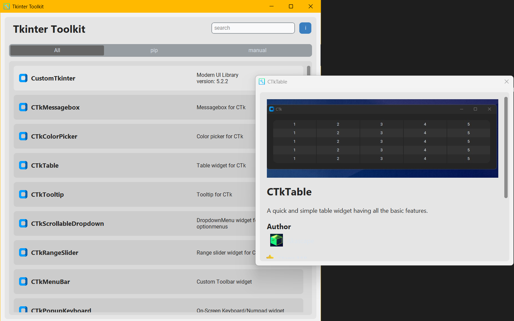

# Referencia a otros objetos customtkinter

## Herramienta de referencia a otros widgets

**Tkinter Toolkit:** <https://github.com/Akascape/tkinter-toolkit>

Herramienta que referencia y muestra componentes basados en librerías `Tk` y `customtkinter`, Expandiendo los widgets modernos.

### Widgets interesantes

- **MoreCustomTkinterWidgets:** <https://github.com/fastattackv/MoreCustomTkinterWidgets/tree/main>

- **CTk Components:** <https://github.com/rudymohammadbali/ctk_components>
  CTk Components is a collection of widgets and utilities designed as extensions or add-ons for customtkinter.
